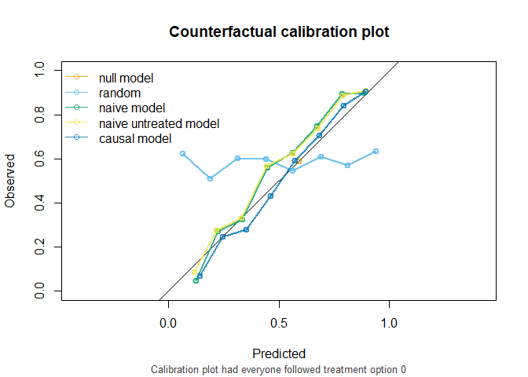
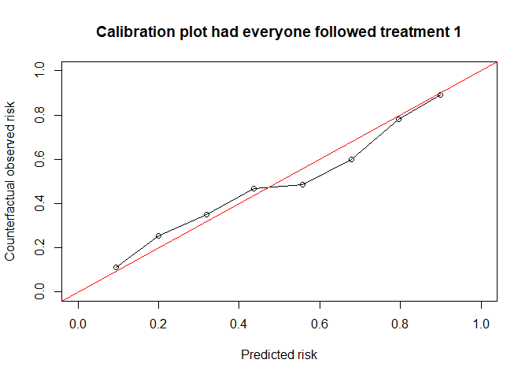
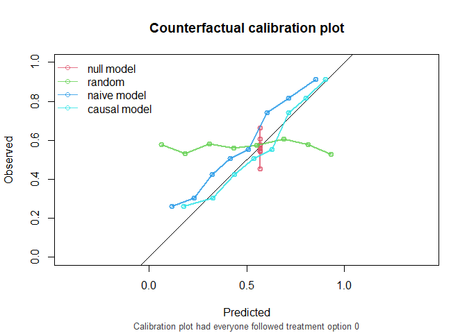

<!-- README.md is generated from README.Rmd. Please edit that file -->

# CFeval <!-- badges: start --> <!-- badges: end -->

Predictions under interventions are estimates of what a subject’s risk
would be if they were to follow a certain counterfactual treatment.
Assessing predictive performance for these predictions is challenging,
as only the outcome of the realized treatment can be observed.(Keogh,
van Geloven, DOI 10.1097/EDE.0000000000001713). This R package
facilitates assessing counterfactual performance of interventional
predictions.

## Installation

You can install the development version of CFeval from
[GitHub](https://github.com/) with:

``` r
# install.packages("devtools")
devtools::github("jvelumc/CFeval")
```

## Toy example

Simulate some example data for binary outcome Y and (point) treatment A,
confounded by a variable L. Variable P is a prognostic variable for only
the outcome. The treatment reduces the risk on a bad outcome (Y = 1) in
this simulated example. The R package contains a 5000 row df_dev and a
4000 row df_val, both simulated as described.

<figure>

<figcaption aria-hidden="true">Figure 1. DAG for toy
example</figcaption>
</figure>

``` r
library(CFeval)
head(df_dev)
#>   id           L A          P Y0 Y1 Y
#> 1  1 -0.56047565 0  0.3500025  1  0 1
#> 2  2 -0.23017749 0  0.8144417  0  0 0
#> 3  3  1.55870831 0 -0.5166661  0  1 0
#> 4  4  0.07050839 1 -2.6922644  0  0 0
#> 5  5  0.12928774 1 -1.0969546  0  0 0
#> 6  6  1.71506499 1 -1.2554751  1  1 1
```

Fitting a logistic regression model on this data without accounting for
the confounder L results in a model where treatment apparently increases
the risk on the outcome

``` r
naive_model <- glm(Y ~ A + P, family = "binomial", data = df_dev)
summary(naive_model)
#> 
#> Call:
#> glm(formula = Y ~ A + P, family = "binomial", data = df_dev)
#> 
#> Coefficients:
#>             Estimate Std. Error z value Pr(>|z|)    
#> (Intercept)  0.11397    0.04514   2.525  0.01157 *  
#> A            0.20486    0.06394   3.204  0.00135 ** 
#> P            1.13624    0.03941  28.828  < 2e-16 ***
#> ---
#> Signif. codes:  0 '***' 0.001 '**' 0.01 '*' 0.05 '.' 0.1 ' ' 1
#> 
#> (Dispersion parameter for binomial family taken to be 1)
#> 
#>     Null deviance: 6897.8  on 4999  degrees of freedom
#> Residual deviance: 5746.9  on 4997  degrees of freedom
#> AIC: 5752.9
#> 
#> Number of Fisher Scoring iterations: 4
```

Fitting a model using IP-weighting to account for the confounder results
in a model where treatment decreases the risk on the outcome, which we
know to be true in our simulated data

``` r
causal_model <- glm(Y ~ A + P, family = "binomial", data = df_dev, 
                    weights = ip_weights(df_dev, A ~ L))
#> Warning in eval(family$initialize): non-integer #successes in a binomial glm!
summary(causal_model)
#> 
#> Call:
#> glm(formula = Y ~ A + P, family = "binomial", data = df_dev, 
#>     weights = ip_weights(df_dev, A ~ L))
#> 
#> Coefficients:
#>             Estimate Std. Error z value Pr(>|z|)    
#> (Intercept)  0.43502    0.03222   13.50   <2e-16 ***
#> A           -0.45611    0.04532  -10.06   <2e-16 ***
#> P            1.11034    0.02763   40.19   <2e-16 ***
#> ---
#> Signif. codes:  0 '***' 0.001 '**' 0.01 '*' 0.05 '.' 0.1 ' ' 1
#> 
#> (Dispersion parameter for binomial family taken to be 1)
#> 
#>     Null deviance: 13788  on 4999  degrees of freedom
#> Residual deviance: 11517  on 4997  degrees of freedom
#> AIC: 11282
#> 
#> Number of Fisher Scoring iterations: 4
```

If either model is to be used to decide on treatment options A, we need
accurate estimates of the counterfactual risk on outcome under both
treatment options A = 1 and A = 0.

Validating a model capable of estimating counterfactual risks is
challenging. This package aims to guide the user in assessing how well
the predictions would match the validation data if all individuals had
followed the treatment under which predictions are made.

The main function CFscore() estimates these counterfactual performance
measures in a validation dataset, printing all assumptions required
along the way.

``` r
results_causal <- CFscore(
  data = df_val,
  model = causal_model, 
  Y = "Y", 
  propensity_formula = A ~ L, 
  treatments = list(0, 1)
)
results_causal
#> Estimation of the performance of the prediction model in a
#>  counterfactual (CF) dataset where everyone's treatment was set to 0 and
#>  1.
#> The following assumptions must be satisfied for correct inference:
#> - Conditional exchangeability requires that {L} are sufficient to
#>  adjust for confounding and selection bias between treatment and
#>  outcome.
#> - Positivity (assess $weights for outliers)
#> - Consistency
#> - No interference
#> - No measurement error
#> - Correctly specified propensity formula
#>    metric   CF0   CF1
#> 1   Brier 0.197 0.212
#> 2     auc 0.753 0.726
#> 3 OEratio 1.003 0.991
```

Weights are exported:

``` r
summary(results_causal$weights)
#>    Min. 1st Qu.  Median    Mean 3rd Qu.    Max. 
#>   1.017   1.339   1.644   1.996   2.207  14.425
```

And calibration plots:

``` r
plot(results_causal)
```



Compare that to the counterfactual performance of the naive model:

``` r
results_naive <- CFscore(
  data = df_val,
  model = naive_model,
  Y = "Y",
  propensity_formula = A ~ L,
  treatments = list(0,1),
  quiet = TRUE
)
results_naive
#>    metric   CF0   CF1
#> 1   Brier 0.201 0.218
#> 2     auc 0.753 0.726
#> 3 OEratio 1.126 0.872
```

``` r
plot(results_naive)
```



## Other options

Bootstrapping for 95% confidence intervals (95CI) - in this setting
(sample size 4000, binary outcome and treatment, 1 confounder) takes
about 30 seconds on my pc with 200 bootstrap iterations. Here we use 50
bootstraps to save time.

``` r
CFscore(
  data = df_val,
  model = causal_model, 
  Y = "Y", 
  propensity_formula = A ~ L, 
  treatments = list(0, 1),
  bootstrap = 50,
  quiet = TRUE
)
#>  bootstrapping :  1 / 50                            bootstrapping :  2 / 50                            bootstrapping :  3 / 50                            bootstrapping :  4 / 50                            bootstrapping :  5 / 50                            bootstrapping :  6 / 50                            bootstrapping :  7 / 50                            bootstrapping :  8 / 50                            bootstrapping :  9 / 50                            bootstrapping :  10 / 50                            bootstrapping :  11 / 50                            bootstrapping :  12 / 50                            bootstrapping :  13 / 50                            bootstrapping :  14 / 50                            bootstrapping :  15 / 50                            bootstrapping :  16 / 50                            bootstrapping :  17 / 50                            bootstrapping :  18 / 50                            bootstrapping :  19 / 50                            bootstrapping :  20 / 50                            bootstrapping :  21 / 50                            bootstrapping :  22 / 50                            bootstrapping :  23 / 50                            bootstrapping :  24 / 50                            bootstrapping :  25 / 50                            bootstrapping :  26 / 50                            bootstrapping :  27 / 50                            bootstrapping :  28 / 50                            bootstrapping :  29 / 50                            bootstrapping :  30 / 50                            bootstrapping :  31 / 50                            bootstrapping :  32 / 50                            bootstrapping :  33 / 50                            bootstrapping :  34 / 50                            bootstrapping :  35 / 50                            bootstrapping :  36 / 50                            bootstrapping :  37 / 50                            bootstrapping :  38 / 50                            bootstrapping :  39 / 50                            bootstrapping :  40 / 50                            bootstrapping :  41 / 50                            bootstrapping :  42 / 50                            bootstrapping :  43 / 50                            bootstrapping :  44 / 50                            bootstrapping :  45 / 50                            bootstrapping :  46 / 50                            bootstrapping :  47 / 50                            bootstrapping :  48 / 50                            bootstrapping :  49 / 50                            bootstrapping :  50 / 50                           
#>    metric   CF0      CF0.95CI   CF1      CF1.95CI
#> 1   Brier 0.197 0.194 - 0.203 0.212 0.208 - 0.214
#> 2     auc 0.753 0.736 - 0.768 0.726 0.718 - 0.735
#> 3 OEratio 1.003 0.977 - 1.022 0.991 0.988 - 1.014
```

Maybe we are only interested in counterfactual performance under level 1

``` r
CFscore(
  data = df_val,
  model = causal_model, 
  Y = "Y", 
  propensity_formula = A ~ L, 
  treatments = 1,
  quiet = TRUE
)
#>    metric   CF1
#> 1   Brier 0.212
#> 2     auc 0.726
#> 3 OEratio 0.991
```

Maybe we have a model for each treatment level

``` r
df_dev$ip <- ip_weights(df_dev, A ~ L)
model0 <- glm(Y ~ P, family = "binomial", data = df_dev[df_dev$A == 0, ], weights = ip)
#> Warning in eval(family$initialize): non-integer #successes in a binomial glm!
model1 <- glm(Y ~ P, family = "binomial", data = df_dev[df_dev$A == 1, ], weights = ip)
#> Warning in eval(family$initialize): non-integer #successes in a binomial glm!

CFscore(
  data = df_val,
  model = list(model0, model1),
  Y = "Y",
  propensity_formula = A ~ L,
  treatments = list(0,1),
  quiet = TRUE
)
#>    metric   CF0   CF1
#> 1   Brier 0.197 0.211
#> 2     auc 0.753 0.726
#> 3 OEratio 1.003 0.990
```

We can also give counterfactual predictions to CFscore, instead of
models

``` r
cf0 <- predict(model0, newdata = df_val, type = "response")
cf1 <- predict(model1, newdata = df_val, type = "response")

CFscore(
  data = df_val,
  predictions = list(cf0, cf1),
  Y = "Y",
  propensity_formula = A ~ L,
  treatments = list(0,1),
  quiet = TRUE
)
#>    metric   CF0   CF1
#> 1   Brier 0.197 0.211
#> 2     auc 0.753 0.726
#> 3 OEratio 1.003 0.990
```

And we can also give it user-specified weights, instead of a propensity
formula.

``` r
prop_model <- glm(A ~ L, family = "binomial", data = df_val)
prop_score <- predict(prop_model, type = "response")
prob_trt <- ifelse(df_val$A == 1, prop_score, 1 - prop_score)
my_ip_weights <- 1 / prob_trt
  
CFscore(
  data = df_val,
  predictions = list(cf0, cf1),
  Y = "Y",
  ip = my_ip_weights,
  A = "A", #need to specify treatment var, which is normally inferred from propensity formula
  treatments = list(0,1),
  quiet = TRUE
)
#>    metric   CF0   CF1
#> 1   Brier 0.197 0.211
#> 2     auc 0.753 0.726
#> 3 OEratio 1.003 0.990
```

We can also assess performance measures on the observed data with the
realized treatment values:

``` r
predictions_naive <- predict(naive_model, type = "response", newdata = df_val)
observed_score(predictions = predictions_naive, Y = df_val$Y)
#>    metric  observed
#> 1   Brier 0.7467057
#> 2     auc 0.2034472
#> 3 OEratio 0.9976336
```
