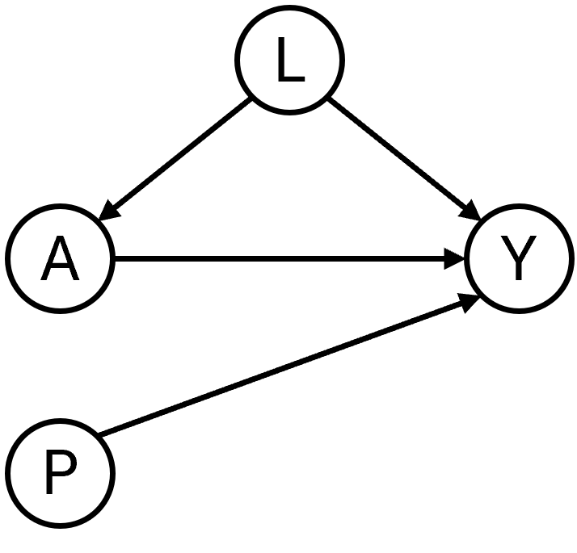

<!-- README.md is generated from README.Rmd. Please edit that file -->

# CFeval <!-- badges: start --> <!-- badges: end -->

Predictions under interventions are estimates of what a subject’s risk
would be if they were to follow a certain counterfactual treatment.
Assessing predictive performance for these predictions is challenging,
as only the outcome of the realized treatment can be observed.(Keogh,
van Geloven, DOI 10.1097/EDE.0000000000001713). This R package
facilitates assessing counterfactual performance of interventional
predictions.

## Installation You can install the development version of CFeval from

[GitHub](https://github.com/) with:

``` r
# install.packages("pak")
pak::pak("jvelumc/CFscore")
```

## Toy example

Simulate some example data for binary outcome Y and (point) treatment A,
confounded by a variable L. Variable P is a prognostic variable for only
the outcome. The treatment reduces the risk on a bad outcome (Y = 1) in
this simulated example. 

``` r
library(CFeval)
df_dev <- build_data(5000)

# Fitting a logistic regression model on this data without accounting for the
# confounder L results in a model where treatment apparently increases the risk
# on the outcome

naive_model <- glm(Y ~ A + P, family = "binomial", data = df_dev)
summary(naive_model)
#> 
#> Call:
#> glm(formula = Y ~ A + P, family = "binomial", data = df_dev)
#> 
#> Coefficients:
#>             Estimate Std. Error z value Pr(>|z|)    
#> (Intercept)  0.09126    0.04528   2.015   0.0439 *  
#> A            0.16056    0.06377   2.518   0.0118 *  
#> P            1.11315    0.03873  28.743   <2e-16 ***
#> ---
#> Signif. codes:  0 '***' 0.001 '**' 0.01 '*' 0.05 '.' 0.1 ' ' 1
#> 
#> (Dispersion parameter for binomial family taken to be 1)
#> 
#>     Null deviance: 6900.7  on 4999  degrees of freedom
#> Residual deviance: 5768.6  on 4997  degrees of freedom
#> AIC: 5774.6
#> 
#> Number of Fisher Scoring iterations: 4

# Fitting a model using IP-weighting to account for the confounder results in a
# model where treatment decreases the risk on the outcome, which we know to be
# true in our simulated data

causal_model <- build_causal_model(df_dev)
#> Warning in eval(family$initialize): non-integer #successes in a binomial glm!
summary(causal_model)
#> 
#> Call:
#> stats::glm(formula = Y ~ A + P, family = "binomial", data = data, 
#>     weights = ipw)
#> 
#> Coefficients:
#>             Estimate Std. Error z value Pr(>|z|)    
#> (Intercept)  0.44902    0.03212   13.98   <2e-16 ***
#> A           -0.55306    0.04511  -12.26   <2e-16 ***
#> P            1.05795    0.02663   39.73   <2e-16 ***
#> ---
#> Signif. codes:  0 '***' 0.001 '**' 0.01 '*' 0.05 '.' 0.1 ' ' 1
#> 
#> (Dispersion parameter for binomial family taken to be 1)
#> 
#>     Null deviance: 13869  on 4999  degrees of freedom
#> Residual deviance: 11663  on 4997  degrees of freedom
#> AIC: 11345
#> 
#> Number of Fisher Scoring iterations: 4
```

If either model is to be used to decide on treatment options A, we need
accurate estimates of the counterfactual risk on outcome under both
treatment options A = 1 and A = 0.

Validating a model capable of estimating counterfactual risks is
challenging. This package aims to guide the user in assessing how well
the predictions would match the validation data if all individuals had
followed the treatment under which predictions are made.

The main function CFscore() estimates these counterfactual performance
measures in a validation dataset, printing all assumptions required
along the way.

``` r
df_val <- build_data(4000)
CFscore(
  data = df_val,
  model = causal_model, 
  Y_column_name = "Y", 
  propensity_formula = A ~ L
)
#> [1] "Estimating the performance of the prediction model in a counterfactual (CF) dataset where everyone received treatment and a CF dataset where nobody received treatment."
#> [1] "The following assumptions must be satisfied for correct inference:"
#> [1] "[1] Conditional exchangeability requires that {L} is sufficient to adjust for confounding and selection bias between A and Y."
#> [1] "[2] Positivity (Assess IPW in the output with $weights)"
#> [1] "[3] Consistency"
#> [1] "[4] No interference"
#> [1] "[5] No measurement error"
#> [1] "[6] Correctly specified propensity formula"
#> 
#> results:
#>        Metric     Naive       CF0       CF1
#> 1   O/E ratio 0.9961310 0.9907166 0.9582589
#> 2         AUC 0.7315905 0.7483907 0.7319487
#> 3 Brier score 0.2089668 0.1987021 0.2088401
#> 
#> Naive performance is the model performance on the observed validation data.
#> CF0/CF1 is the estimated model performance on a CF dataset where everyone was untreated/treated, respectively.
```

Compare that to the counterfactual performance of the naive model:

``` r
CFscore(
  data = df_val,
  model = naive_model,
  Y_column_name = "Y",
  propensity_formula = A ~ L,
  quiet_mode = TRUE # hides all the additional output.
)
#>        Metric     Naive       CF0       CF1
#> 1   O/E ratio 1.0004983 1.1296686 0.8336038
#> 2         AUC 0.7452893 0.7483907 0.7319487
#> 3 Brier score 0.2040223 0.2031305 0.2165036
```
