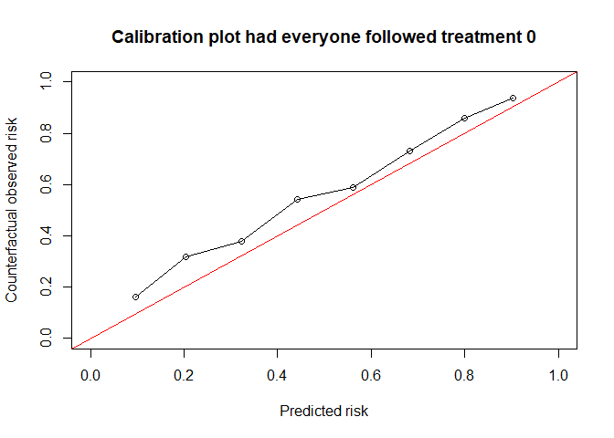
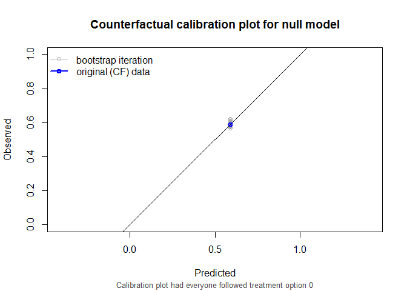
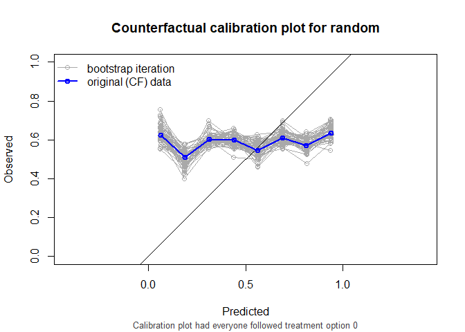
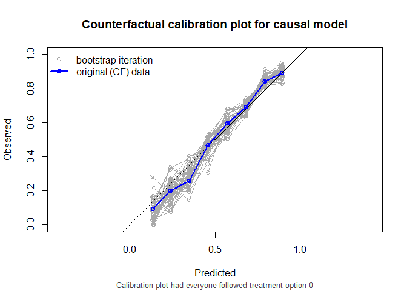
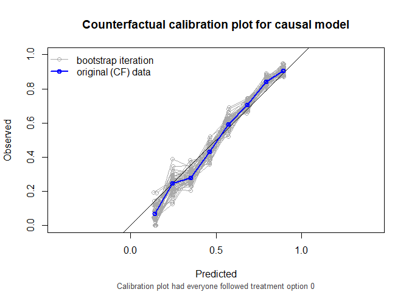

<!-- README.md is generated from README.Rmd. Please edit that file -->

# CFeval <!-- badges: start --> <!-- badges: end -->

Prediction under interventions considers estimating what a subject’s
risk would be if they were to receive a certain treatment. Likewise one
may be interested in assessing predictive performance in a setting where
all individuals were to receive a certain treatment option. This is
challenging, as only the outcome of the realized treatment level can be
observed in the data, and outcomes under any treatment option are
counterfactual.(Keogh, van Geloven, DOI 10.1097/EDE.0000000000001713).
This R package facilitates assessing counterfactual performance of
predictions.

## Installation

You can install the development version of CFeval from
[GitHub](https://github.com/) with:

``` r
# install.packages("devtools")
devtools::install_github("jvelumc/CFeval")
```

## Example

Simulate example data for binary outcome $Y$ and point treatment $A$,
with the relation between $A$ and $Y$ confounded by variable $L$.
Variable $P$ is a prognostic variable for only the outcome. The
treatment reduces the risk on a bad outcome ($Y = 1$) in this simulated
example.

<figure>

<figcaption aria-hidden="true">Figure 1. DAG for toy
example</figcaption>
</figure>

``` r
n <- 1000

df_dev <- data.frame(id = 1:n)
df_dev$L <- rnorm(n)
df_dev$A <- rbinom(n, 1, plogis(df_dev$L))
df_dev$P <- rnorm(n)
df_dev$Y <- rbinom(n, 1, plogis(0.5 + df_dev$L + 1.25 * df_dev$P - 0.6*df_dev$A))
```

We also need something to validate. We will create a couple of models
using the development data.

``` r
# naive model, not accounting for confounding variable L
naive_model <- glm(Y ~ A + P, family = "binomial", data = df_dev)

# model targeting untreated risk, not accounting for confounding
naive_untreated_model <- glm(Y ~ P, family = "binomial", data = df_dev[df_dev$A == 0, ])

# causal model, accounting for L by IP-weighting
trt_model <- glm(A ~ L, family = "binomial", data = df_dev)
propensity_score <- predict(trt_model, type = "response")
df_dev$iptw <- 1 / ifelse(df_dev$A == 1, propensity_score, 1 - propensity_score)
causal_model <- glm(Y ~ A + P, family = "binomial", data = df_dev, weights = iptw)
#> Warning in eval(family$initialize): non-integer #successes in a binomial glm!

# a model that randomly predicts something, not very good probably
random_predictions <- runif(5000, 0, 1)
```

Note that according to the naive model, we should not treat anybody, as
patients that get treated have a higher risk for the outcome. The causal
model correctly infers that treatment benefits patients.

``` r
print(coefficients(naive_model))
#> (Intercept)           A           P 
#>   0.1167948   0.2568862   0.9279159
print(coefficients(causal_model))
#> (Intercept)           A           P 
#>   0.4085166  -0.5148785   0.9022130
```

We are now interested in how the models perform in an external
validation dataset. This dataset can have a different causal structure
from the original development dataset. In this example, we simulate that
patients are treated more aggressively. The relation between the outcome
and the other variables is the same.

``` r
n <- 5000

df_val <- data.frame(id = 1:n)
df_val$L <- rnorm(n)
df_val$A <- rbinom(n, 1, plogis(0.5 + df_val$L))
df_val$P <- rnorm(n)
df_val$Y <- rbinom(n, 1, plogis(0.5 + df_val$L + 1.25 * df_val$P - 0.6*df_val$A))
```

The question that we would like to have answered is the following:

How well does our prediction model perform if we were to treat nobody?

The CFeval package aims to provide tools to answer questions like this.
The main function `CFscore()` can be used for this.

``` r
library(CFeval)

CFscore(
  object = list(
    "random" = random_predictions,
    "naive model" = naive_model,
    "naive untreated model" = naive_untreated_model,
    "causal model" = causal_model
  ),
  data = df_val, 
  outcome_formula = Y ~ 1,
  treatment_formula = A ~ L, 
  treatment_of_interest = 0
)
#> Estimation of the performance of the prediction model in a
#>  counterfactual (CF) dataset where everyone's treatment A was set to 0.
#> The following assumptions must be satisfied for correct inference:
#> - Conditional exchangeability requires that given IP-weights are
#>  sufficient to adjust for confounding and selection bias between
#>  treatment and outcome.
#> - Positivity (assess $ipt$weights for outliers)
#> - Consistency
#> - No interference
#> - Correctly specified propensity formula. Estimated treatment model is
#>  logit(A) = 0.49 + 0.96*L. See also $ipt$model
#> 
#>                  model   auc brier oeratio
#>             null model 0.500 0.242    1.00
#>                 random 0.512 0.327    1.19
#>            naive model 0.760 0.199    1.12
#>  naive untreated model 0.760 0.198    1.12
#>           causal model 0.760 0.195    1.01
```


As we see, the causal model has best calibration and Brier score.

Note that the AUC of the naive models and the causal model are equal.
AUC is driven entirely by how individuals’ model predictions are ranked,
not by the magnitude of the predictions. In this simple setting, P is
the only variable driving prognostic differences between individuals (in
a pseudopopulation where we counterfactually set everyone’s treatment
status to $0$). While the models have different coefficients for P,
individuals are ranked in exactly the same way.

$CFscore()$ also supports stabilized weights and bootstrapping for
confidence intervals. Right censored survival data and cox models are
also supported.

``` r
CFscore(
  object = list(
    "random" = random_predictions,
    "naive model" = naive_model,
    "naive untreated model" = naive_untreated_model,
    "causal model" = causal_model
  ),
  data = df_val, 
  outcome_formula = Y ~ 1,
  treatment_formula = A ~ L, 
  treatment_of_interest = 0,
  bootstrap = 50,
  bootstrap_progress = FALSE,
  stable_iptw = TRUE,
  quiet = TRUE
)
#> 
#> auc
#> 
#>                  model   auc lower upper
#>             null model 0.500 0.500 0.500
#>                 random 0.512 0.479 0.540
#>            naive model 0.760 0.726 0.782
#>  naive untreated model 0.760 0.726 0.782
#>           causal model 0.760 0.726 0.782
#> 
#> brier
#> 
#>                  model brier lower upper
#>             null model 0.242 0.237 0.245
#>                 random 0.327 0.312 0.348
#>            naive model 0.199 0.192 0.209
#>  naive untreated model 0.198 0.191 0.209
#>           causal model 0.195 0.187 0.204
#> 
#> oeratio
#> 
#>                  model oeratio lower upper
#>             null model    1.00 0.977  1.05
#>                 random    1.19 1.147  1.25
#>            naive model    1.12 1.100  1.18
#>  naive untreated model    1.12 1.100  1.18
#>           causal model    1.01 0.984  1.06
```


