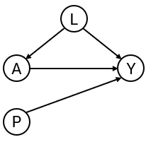

<!-- README.md is generated from README.Rmd. Please edit that file -->

# CFeval <!-- badges: start --> <!-- badges: end -->

Prediction under interventions considers estimating what a subject’s
risk would be if they were to receive a certain treatment. Likewise one
may be interested in assessing predictive performance in a setting where
all individuals were to receive a certain treatment option. This is
challenging, as only the outcome of the realized treatment level can be
observed in the data, and outcomes under any treatment option are
counterfactual.(Keogh, van Geloven, DOI 10.1097/EDE.0000000000001713).
This R package facilitates assessing counterfactual performance of
predictions.

## Installation

You can install the development version of CFeval from
[GitHub](https://github.com/) with:

``` r
# install.packages("devtools")
devtools::install_github("jvelumc/CFeval")
```

``` r
library(CFeval)
```

## Example

Simulate example data for binary outcome $Y$ and point treatment $A$,
with the relation between $A$ and $Y$ confounded by variable $L$.
Variable $P$ is a prognostic variable for only the outcome. The
treatment reduces the risk on a bad outcome ($Y = 1$) in this simulated
example.

<figure>

<figcaption aria-hidden="true">Figure 1. DAG for toy
example</figcaption>
</figure>

``` r
simulate_data <- function(n, seed) {
  data <- data.frame(id = 1:n)
  data$L <- rnorm(n)
  data$A <- rbinom(n, 1, plogis(2*data$L))
  data$P <- rnorm(n)
  data$Y <- rbinom(n, 1, plogis(0.5 + data$L + 1.25 * data$P - 0.9*data$A))
  data
}

df_dev <- simulate_data(n = 2000, seed = 1)
```

We also need something to validate. We will create a couple of models
using the development data.

``` r
# naive model, not accounting for confounding variable L
naive_model <- glm(Y ~ A + P, family = "binomial", data = df_dev)

# causal model, accounting for L by IP-weighting
trt_model <- glm(A ~ L, family = "binomial", data = df_dev)
propensity_score <- predict(trt_model, type = "response")
df_dev$iptw <- 1 / ifelse(df_dev$A == 1, propensity_score, 1 - propensity_score)
causal_model <- glm(Y ~ A + P, family = "binomial", data = df_dev, weights = iptw)
#> Warning in eval(family$initialize): non-integer #successes in a binomial glm!

# a model that randomly predicts something, not very good probably
random_predictions <- runif(5000, 0, 1)
```

Note that according to the naive model, we should not treat anybody, as
patients that get treated have a higher risk for the outcome. The causal
model correctly infers that treatment benefits patients.

``` r
print(coefficients(naive_model))
#> (Intercept)           A           P 
#>  -0.1088558   0.3407801   1.1878727
print(coefficients(causal_model))
#> (Intercept)           A           P 
#>   0.3862409  -0.6863653   1.1949409
```

We are now interested in how the models perform in an external
validation dataset. This dataset can have a different causal structure
from the original development dataset. In this example, the data is
simulated in the same way.

``` r
df_val <- simulate_data(n = 5000, seed = 2)
```

One option to validate the models would be to leave the data as it is,
and compute the performance metrics on this observed dataset, where some
patients were treated and others were not. This package has a function
that can do this, but it is not recommended to use it. For demonstration
purposes, we use it here nonetheless.

``` r
observed_score(
  object = list(
    "random" = random_predictions,
    "naive model" = naive_model,
    "causal model" = causal_model
  ),
  data = df_val, 
  outcome_formula = Y ~ 1,
  metrics = c("auc", "brier", "oeratio")
)
#> 
#>         model   auc brier oeratio
#>        random 0.505 0.331   1.010
#>   naive model 0.764 0.198   0.998
#>  causal model 0.741 0.207   1.001
```

From this it seems that the naive model performs better than the fancy
causal model. These performance measures represent the performance of
the models under the given treatment assignment strategy.

However, we are thinking of a scenario in which treatment assignment
will be different in the future. For example, the models may be used to
inform whether patients should receive treatment or not. For patients
and clinicians, it is then important to know what their treated risk
would be and their untreated risk.

It is then important that these treated risks are accurate compared to
the outcomes patients would get if they were to be treated, and that the
untreated risks are accurate compared to the outcomes they would get if
left untreated.

The question that we would like to have answered is the following:

How well does our prediction model perform if we were to treat nobody?
And if we were to treat everybody?

The CFeval package aims to provide tools to answer questions like these.
The main function `CFscore()` can be used for this. This function
estimates several counterfactual performance measures in a validation
dataset, printing by default the assumptions required for valid
inference. The first argument is the object to validate. This can be a
glm model, a coxph model for survival data, or a numeric vector
corresponding to predicted risks, or a combination of these options.
Other arguments supplied are the models and the validation data, a
formula for which the left hand side denotes the outcome variable in the
validation data, a treatment formula for which the left hand side
denotes the treatment variable and the right hand side the confounders
required to adjust for said treatment, and the hypothetical treatment
option for which you want to know how well the model performs if
everyone in the population was (counterfactually) assigned to that
treatment.

If nobody would have been treated:

``` r
CFscore(
  object = list(
    "random" = random_predictions,
    "naive model" = naive_model,
    "causal model" = causal_model
  ),
  data = df_val, 
  outcome_formula = Y ~ 1,
  treatment_formula = A ~ L, 
  treatment_of_interest = 0
)
#> [1] "1"
#> [1] "yes"
#> [1] "yes"
#> [1] "yes"
#> Estimation of the performance of the prediction model in a
#>  counterfactual (CF) dataset where everyone's treatment A was set to 0.
#> The following assumptions must be satisfied for correct inference:
#> - Conditional exchangeability requires that given IP-weights are
#>  sufficient to adjust for confounding and selection bias between
#>  treatment and outcome.
#> - Positivity (assess $ipt$weights for outliers)
#> - Consistency
#> - No interference
#> - Correctly specified propensity formula. Estimated treatment model is
#>  logit(A) = -0.07 + 2.05*L. See also $ipt$model
#> 
#>         model   auc brier oeratio
#>    null model 0.500 0.245    1.00
#>        random 0.496 0.335    1.14
#>   naive model 0.766 0.204    1.20
#>  causal model 0.766 0.196    1.00
```


And similarly, if everybody would have been treated (not printing the
assumptions again):

``` r
CFscore(
  object = list(
    "random" = random_predictions,
    "naive model" = naive_model,
    "causal model" = causal_model
  ),
  data = df_val, 
  outcome_formula = Y ~ 1,
  treatment_formula = A ~ L, 
  treatment_of_interest = 1,
  quiet = TRUE
)
#> [1] "1"
#> [1] "yes"
#> [1] "yes"
#> [1] "yes"
#> 
#>         model   auc brier oeratio
#>    null model 0.500 0.241   1.000
#>        random 0.533 0.314   0.812
#>   naive model 0.739 0.218   0.751
#>  causal model 0.739 0.202   0.930
```


As we see, the causal model has best calibration and Brier score.

Note that the AUC of the naive model and the causal model are equal. AUC
is driven entirely by how individuals’ model predictions are ranked, not
by the magnitude of the predictions. In this simple setting, P is the
only variable driving prognostic differences between individuals (in a
pseudopopulation where we counterfactually set everyone’s treatment
status to $0$). While the models have different coefficients for P,
individuals are ranked in exactly the same way.

$CFscore()$ also supports stabilized weights and bootstrapping for
confidence intervals. Right censored survival data and cox models are
also supported.

``` r
CFscore(
  object = list(
    "random" = random_predictions,
    "naive model" = naive_model,
    "causal model" = causal_model
  ),
  data = df_val, 
  outcome_formula = Y ~ 1,
  treatment_formula = A ~ L, 
  treatment_of_interest = 0,
  bootstrap = 50,
  bootstrap_progress = FALSE,
  stable_iptw = TRUE,
  quiet = TRUE
)
#> [1] "1"
#> [1] "yes"
#> [1] "yes"
#> [1] "yes"
#> [1] "1"
#> [1] "yes"
#> [1] "yes"
#> [1] "yes"
#> [1] "1"
#> [1] "yes"
#> [1] "yes"
#> [1] "yes"
#> [1] "1"
#> [1] "yes"
#> [1] "yes"
#> [1] "yes"
#> [1] "1"
#> [1] "yes"
#> [1] "yes"
#> [1] "yes"
#> [1] "1"
#> [1] "yes"
#> [1] "yes"
#> [1] "yes"
#> [1] "1"
#> [1] "yes"
#> [1] "yes"
#> [1] "yes"
#> [1] "1"
#> [1] "yes"
#> [1] "yes"
#> [1] "yes"
#> [1] "1"
#> [1] "yes"
#> [1] "yes"
#> [1] "yes"
#> [1] "1"
#> [1] "yes"
#> [1] "yes"
#> [1] "yes"
#> [1] "1"
#> [1] "yes"
#> [1] "yes"
#> [1] "yes"
#> [1] "1"
#> [1] "yes"
#> [1] "yes"
#> [1] "yes"
#> [1] "1"
#> [1] "yes"
#> [1] "yes"
#> [1] "yes"
#> [1] "1"
#> [1] "yes"
#> [1] "yes"
#> [1] "yes"
#> [1] "1"
#> [1] "yes"
#> [1] "yes"
#> [1] "yes"
#> [1] "1"
#> [1] "yes"
#> [1] "yes"
#> [1] "yes"
#> [1] "1"
#> [1] "yes"
#> [1] "yes"
#> [1] "yes"
#> [1] "1"
#> [1] "yes"
#> [1] "yes"
#> [1] "yes"
#> [1] "1"
#> [1] "yes"
#> [1] "yes"
#> [1] "yes"
#> [1] "1"
#> [1] "yes"
#> [1] "yes"
#> [1] "yes"
#> [1] "1"
#> [1] "yes"
#> [1] "yes"
#> [1] "yes"
#> [1] "1"
#> [1] "yes"
#> [1] "yes"
#> [1] "yes"
#> [1] "1"
#> [1] "yes"
#> [1] "yes"
#> [1] "yes"
#> [1] "1"
#> [1] "yes"
#> [1] "yes"
#> [1] "yes"
#> [1] "1"
#> [1] "yes"
#> [1] "yes"
#> [1] "yes"
#> [1] "1"
#> [1] "yes"
#> [1] "yes"
#> [1] "yes"
#> [1] "1"
#> [1] "yes"
#> [1] "yes"
#> [1] "yes"
#> [1] "1"
#> [1] "yes"
#> [1] "yes"
#> [1] "yes"
#> [1] "1"
#> [1] "yes"
#> [1] "yes"
#> [1] "yes"
#> [1] "1"
#> [1] "yes"
#> [1] "yes"
#> [1] "yes"
#> [1] "1"
#> [1] "yes"
#> [1] "yes"
#> [1] "yes"
#> [1] "1"
#> [1] "yes"
#> [1] "yes"
#> [1] "yes"
#> [1] "1"
#> [1] "yes"
#> [1] "yes"
#> [1] "yes"
#> [1] "1"
#> [1] "yes"
#> [1] "yes"
#> [1] "yes"
#> [1] "1"
#> [1] "yes"
#> [1] "yes"
#> [1] "yes"
#> [1] "1"
#> [1] "yes"
#> [1] "yes"
#> [1] "yes"
#> [1] "1"
#> [1] "yes"
#> [1] "yes"
#> [1] "yes"
#> [1] "1"
#> [1] "yes"
#> [1] "yes"
#> [1] "yes"
#> [1] "1"
#> [1] "yes"
#> [1] "yes"
#> [1] "yes"
#> [1] "1"
#> [1] "yes"
#> [1] "yes"
#> [1] "yes"
#> [1] "1"
#> [1] "yes"
#> [1] "yes"
#> [1] "yes"
#> [1] "1"
#> [1] "yes"
#> [1] "yes"
#> [1] "yes"
#> [1] "1"
#> [1] "yes"
#> [1] "yes"
#> [1] "yes"
#> [1] "1"
#> [1] "yes"
#> [1] "yes"
#> [1] "yes"
#> [1] "1"
#> [1] "yes"
#> [1] "yes"
#> [1] "yes"
#> [1] "1"
#> [1] "yes"
#> [1] "yes"
#> [1] "yes"
#> [1] "1"
#> [1] "yes"
#> [1] "yes"
#> [1] "yes"
#> [1] "1"
#> [1] "yes"
#> [1] "yes"
#> [1] "yes"
#> [1] "1"
#> [1] "yes"
#> [1] "yes"
#> [1] "yes"
#> [1] "1"
#> [1] "yes"
#> [1] "yes"
#> [1] "yes"
#> [1] "1"
#> [1] "yes"
#> [1] "yes"
#> [1] "yes"
#> 
#> auc
#> 
#>         model   auc lower upper
#>    null model 0.500 0.500 0.500
#>        random 0.496 0.471 0.526
#>   naive model 0.766 0.740 0.801
#>  causal model 0.766 0.740 0.801
#> 
#> brier
#> 
#>         model brier lower upper
#>    null model 0.245 0.241 0.249
#>        random 0.335 0.316 0.351
#>   naive model 0.204 0.189 0.215
#>  causal model 0.196 0.181 0.208
#> 
#> oeratio
#> 
#>         model oeratio lower upper
#>    null model    1.00 0.947  1.06
#>        random    1.14 1.083  1.21
#>   naive model    1.20 1.144  1.27
#>  causal model    1.00 0.949  1.05
```


