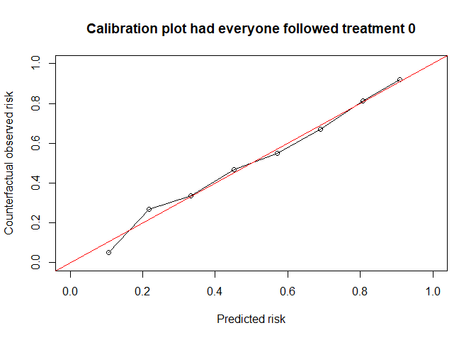

<!-- README.md is generated from README.Rmd. Please edit that file -->

# CFeval <!-- badges: start --> <!-- badges: end -->

Prediction under interventions considers estimating what a subject’s
risk would be if they were to receive a certain treatment. Likewise one
may be interested in assessing predictive performance in a setting where
all individuals were to receive a certain treatment. This is
challenging, as only the outcome of the realized treatment level can be
observed in the data, and outcomes under any treatment level are
counterfactual.(Keogh, van Geloven, DOI 10.1097/EDE.0000000000001713).
This R package facilitates assessing counterfactual predictive
performance.

## Installation

You can install the development version of CFeval from
[GitHub](https://github.com/) with:

``` r
# install.packages("devtools")
devtools::install_github("jvelumc/CFeval")
```

## Toy example

Simulate example data for binary outcome Y and (point) treatment A, with
the relation between A and Y confounded by a variable L. Variable P is a
prognostic variable for only the outcome. The treatment reduces the risk
on a bad outcome (Y = 1) in this simulated example. The R package
contains a 5000 row df_dev and a 4000 row df_val, both simulated as
described.

<figure>

<figcaption aria-hidden="true">Figure 1. DAG for toy
example</figcaption>
</figure>

``` r
library(CFeval)

simulate_data <- function(n) {
  df <- data.frame(id = 1:n)
  df$L <- rnorm(n)
  df$A <- rbinom(n, 1, plogis(df$L))
  df$P <- rnorm(n)
  df$Y <- rbinom(n, 1, plogis(0.5 + df$L + 1.25 * df$P - 0.6*df$A))
  return(df)
}

set.seed(123)
df_dev <- simulate_data(5000)
df_val <- simulate_data(4000)

head(df_dev)
#>   id           L A          P Y
#> 1  1 -0.56047565 0  0.3500025 1
#> 2  2 -0.23017749 0  0.8144417 0
#> 3  3  1.55870831 0 -0.5166661 0
#> 4  4  0.07050839 1 -2.6922644 0
#> 5  5  0.12928774 1 -1.0969546 0
#> 6  6  1.71506499 1 -1.2554751 1
```

We will use df_dev for model development. The independent df_val will be
used to validate the model performance.

Fitting a logistic regression model on this data without accounting for
the confounder L results in a model where treatment apparently increases
the risk on the outcome

``` r
naive_model <- glm(Y ~ A + P, family = "binomial", data = df_dev)
summary(naive_model)
#> 
#> Call:
#> glm(formula = Y ~ A + P, family = "binomial", data = df_dev)
#> 
#> Coefficients:
#>             Estimate Std. Error z value Pr(>|z|)    
#> (Intercept)  0.11227    0.04483   2.504  0.01227 *  
#> A            0.16547    0.06342   2.609  0.00908 ** 
#> P            1.09134    0.03862  28.257  < 2e-16 ***
#> ---
#> Signif. codes:  0 '***' 0.001 '**' 0.01 '*' 0.05 '.' 0.1 ' ' 1
#> 
#> (Dispersion parameter for binomial family taken to be 1)
#> 
#>     Null deviance: 6903.5  on 4999  degrees of freedom
#> Residual deviance: 5819.2  on 4997  degrees of freedom
#> AIC: 5825.2
#> 
#> Number of Fisher Scoring iterations: 4
```

Fitting a model using IP-weighting to account for the confounder results
in a model where treatment decreases the risk on the outcome, which we
know to be true in our simulated data

``` r

propensity_model <- glm(A ~ L, family = "binomial", df_dev)
prop_score <- predict(propensity_model, type = "response")
prob_trt <- ifelse(df_dev$A == 1, prop_score, 1 - prop_score)
ipw <- 1 / prob_trt

causal_model <- glm(Y ~ A + P, family = "binomial", data = df_dev, 
                    weights = ipw)
#> Warning in eval(family$initialize): non-integer #successes in a binomial glm!
summary(causal_model)
#> 
#> Call:
#> glm(formula = Y ~ A + P, family = "binomial", data = df_dev, 
#>     weights = ipw)
#> 
#> Coefficients:
#>             Estimate Std. Error z value Pr(>|z|)    
#> (Intercept)  0.43083    0.03207   13.44   <2e-16 ***
#> A           -0.48505    0.04514  -10.75   <2e-16 ***
#> P            1.08065    0.02727   39.62   <2e-16 ***
#> ---
#> Signif. codes:  0 '***' 0.001 '**' 0.01 '*' 0.05 '.' 0.1 ' ' 1
#> 
#> (Dispersion parameter for binomial family taken to be 1)
#> 
#>     Null deviance: 13798  on 4999  degrees of freedom
#> Residual deviance: 11602  on 4997  degrees of freedom
#> AIC: 11383
#> 
#> Number of Fisher Scoring iterations: 4
```

From now on we assume some model has been developed (be it a good or a
bad one), and we want to know if it provides accurate estimates of the
counterfactual risk on outcome under both treatment options a = 1 and a
= 0.

This package aims to help the user in assessing how well the predictions
would match the validation data if all individuals in the validation
data had followed a certain treatment option of interest.

The main function CFscore() estimates several counterfactual performance
measures in a validation dataset, printing the assumptions required
along the way.

``` r
results_CF0 <- CFscore(
  validation_data = df_val,
  model = list("naive model" = naive_model, "causal model" = causal_model), 
  outcome_column = "Y", 
  propensity_formula = A ~ L, 
  treatment_of_interest = 0
)
results_CF0
#> Estimation of the performance of the prediction model in a
#>  counterfactual (CF) dataset where everyone's treatment A was set to 0.
#> The following assumptions must be satisfied for correct inference:
#> - Conditional exchangeability requires that {L} are sufficient to
#>  adjust for confounding and selection bias between treatment and
#>  outcome.
#> - Positivity (assess $weights for outliers)
#> - Consistency
#> - No interference
#> - Correctly specified propensity formula
#> 
#>         model   auc brier    oe
#>    null.model 0.500 0.244 1.000
#>   naive model 0.741 0.204 1.115
#>  causal model 0.741 0.201 0.994
#> model:  null.model
```


    #> model:  naive model


    #> model:  causal model


Weights are exported:

``` r
summary(results_CF0$ipweights)
#>    Min. 1st Qu.  Median    Mean 3rd Qu.    Max. 
#>   1.018   1.336   1.645   1.999   2.192  22.353
```

See also the counterfactual score under treatment option 1

``` r
results_CF1 <- CFscore(
  validation_data = df_val,
  model = list("naive model" = naive_model, "causal model" = causal_model), 
  outcome_column = "Y", 
  propensity_formula = A ~ L, 
  treatment_of_interest = 0,
  quiet = TRUE
)
results_CF1
#> 
#>         model   auc brier    oe
#>    null.model 0.500 0.244 1.000
#>   naive model 0.741 0.204 1.115
#>  causal model 0.741 0.201 0.994
#> model:  null.model
```



    #> model:  naive model


    #> model:  causal model


## Other options

Bootstrapping for 95% confidence intervals (95CI) - in this setting
(sample size 4000, binary outcome and treatment, 1 confounder) takes
about 30 seconds on my pc with 200 bootstrap iterations. Here we use 50
bootstraps to save time.

``` r
CFscore(
  validation_data = df_val,
  model = list("naive model" = naive_model, "causal model" = causal_model), 
  outcome_column = "Y", 
  propensity_formula = A ~ L, 
  treatment_of_interest = 0,
  metrics = c("auc", "brier", "oe"),
  bootstrap = TRUE,
  bootstrap_iterations = 50,
  quiet = TRUE
)
#>  bootstrapping :  1 / 50                            bootstrapping :  2 / 50                            bootstrapping :  3 / 50                            bootstrapping :  4 / 50                            bootstrapping :  5 / 50                            bootstrapping :  6 / 50                            bootstrapping :  7 / 50                            bootstrapping :  8 / 50                            bootstrapping :  9 / 50                            bootstrapping :  10 / 50                            bootstrapping :  11 / 50                            bootstrapping :  12 / 50                            bootstrapping :  13 / 50                            bootstrapping :  14 / 50                            bootstrapping :  15 / 50                            bootstrapping :  16 / 50                            bootstrapping :  17 / 50                            bootstrapping :  18 / 50                            bootstrapping :  19 / 50                            bootstrapping :  20 / 50                            bootstrapping :  21 / 50                            bootstrapping :  22 / 50                            bootstrapping :  23 / 50                            bootstrapping :  24 / 50                            bootstrapping :  25 / 50                            bootstrapping :  26 / 50                            bootstrapping :  27 / 50                            bootstrapping :  28 / 50                            bootstrapping :  29 / 50                            bootstrapping :  30 / 50                            bootstrapping :  31 / 50                            bootstrapping :  32 / 50                            bootstrapping :  33 / 50                            bootstrapping :  34 / 50                            bootstrapping :  35 / 50                            bootstrapping :  36 / 50                            bootstrapping :  37 / 50                            bootstrapping :  38 / 50                            bootstrapping :  39 / 50                            bootstrapping :  40 / 50                            bootstrapping :  41 / 50                            bootstrapping :  42 / 50                            bootstrapping :  43 / 50                            bootstrapping :  44 / 50                            bootstrapping :  45 / 50                            bootstrapping :  46 / 50                            bootstrapping :  47 / 50                            bootstrapping :  48 / 50                            bootstrapping :  49 / 50                            bootstrapping :  50 / 50                           
#> 
#> auc
#> 
#>         model   auc lower upper
#>    null.model 0.500 0.500 0.500
#>   naive model 0.741 0.723 0.764
#>  causal model 0.741 0.723 0.764
#> 
#> brier
#> 
#>         model brier lower upper
#>    null.model 0.244 0.240 0.247
#>   naive model 0.204 0.196 0.213
#>  causal model 0.201 0.193 0.208
#> 
#> oe
#> 
#>         model    oe lower upper
#>    null.model 1.000 0.968  1.03
#>   naive model 1.115 1.078  1.16
#>  causal model 0.994 0.962  1.03
```

We can also give counterfactual predictions to CFscore, instead of
models

``` r

# this is a bit stupid example, defining df_valA0 and then using df_val in CFscore. Makes more sense when you have complicated prediction, such as for time dependent confounding. Don't pay too much attention to this right now.
df_valA0 <- df_val
df_valA0$A <- 0
cf0 <- predict(causal_model, newdata = df_valA0, type = "response")

CFscore(
  validation_data = df_val,
  predictions = cf0,
  outcome_column = "Y", 
  propensity_formula = A ~ L, 
  treatment_of_interest = 0,
  metrics = c("auc", "brier", "oe"),
  quiet = TRUE
)
#> 
#>       model   auc brier    oe
#>  null.model 0.500 0.244 1.000
#>     model.1 0.741 0.201 0.994
```

And we can also give it user-specified weights, instead of a propensity
formula.

``` r
prop_model <- glm(A ~ L, family = "binomial", data = df_val)
prop_score <- predict(prop_model, type = "response")
prob_trt <- ifelse(df_val$A == 1, prop_score, 1 - prop_score)
my_ip_weights <- 1 / prob_trt

CFscore(
  validation_data = df_val,
  predictions = cf0,
  outcome_column = "Y", 
  ipweights = my_ip_weights,
  treatment_column = "A", #need to specify treatment var, which is normally inferred from propensity formula
  treatment_of_interest = 0,
  metrics = c("auc", "brier", "oe"),
  quiet = TRUE
)
#> 
#>       model   auc brier    oe
#>  null.model 0.500 0.244 1.000
#>     model.1 0.741 0.201 0.994
```
