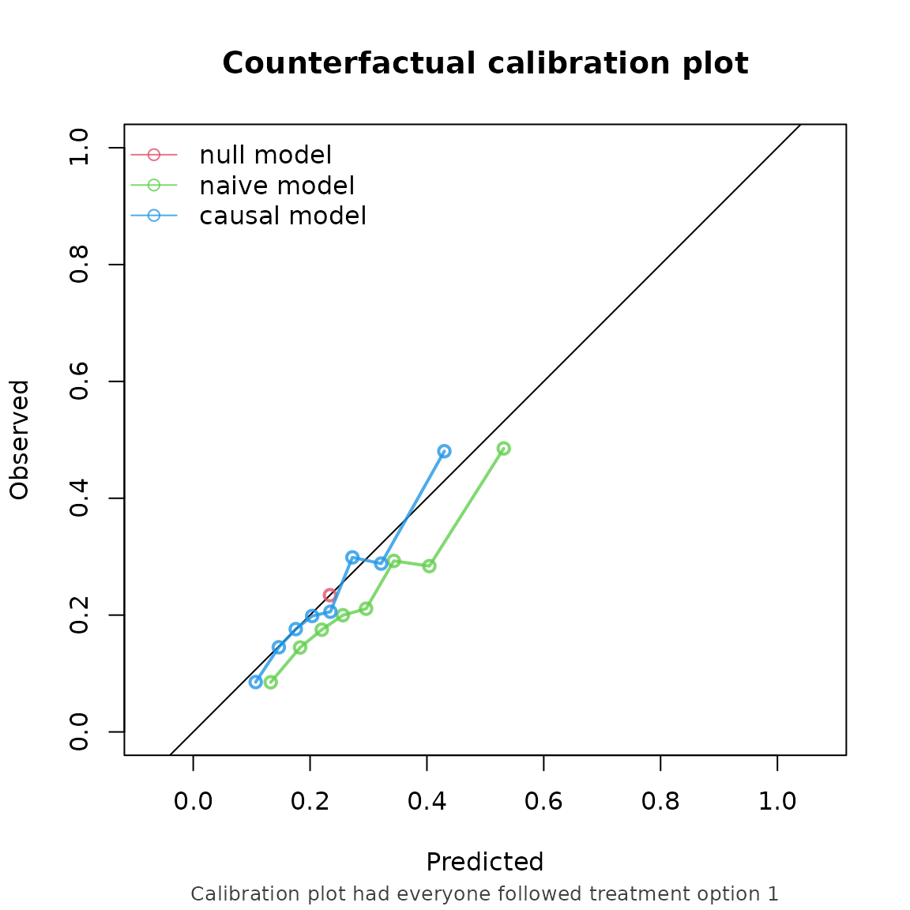
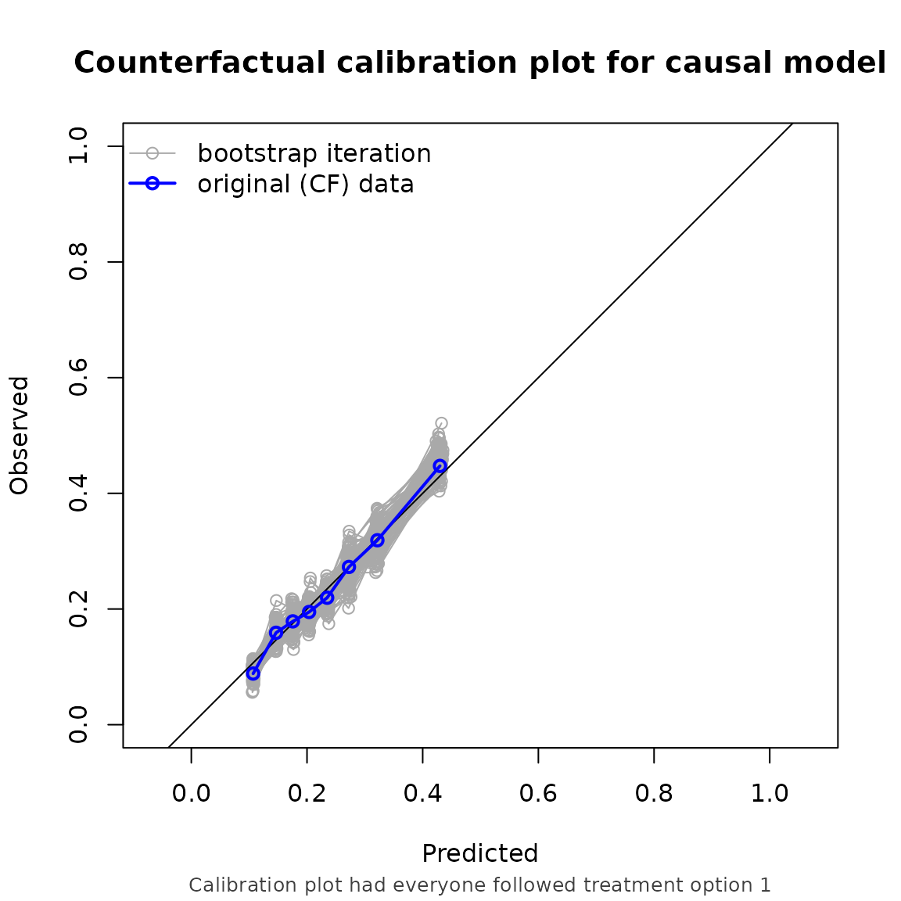

# CFeval

``` r
library(CFeval)
library(survival)
set.seed(123)
```

## Evaluating performance for time to event data.

The README covers binary outcome. This vignette demonstrates how to
estimate counterfactual performance metrics in right censored survival
data.

Just like in the binary outcome, a IPT-weighted pseudopopulation is
built which represents a situation in which everybody gets the treatment
of interest. On top of that, inverse probability of censor weights are
used such that the pseudopopulation also represents a situation where
nobody gets censored.

### Example 1, non informative censoring

``` r
simulate_time_to_event <- function(n, constant_baseline_haz, LP) {
  u <- runif(n)
  -log(u) / (constant_baseline_haz * exp(LP))
}

horizon <- 10
n <- 10000
data <- data.frame(
  L1 = rnorm(n, mean = 0),
  L2 = rbinom(n, 1, 0.5),
  P1 = rnorm(n, mean = 0),
  P2 = rbinom(n, 1, 0.5)
)
data$A <- rbinom(n, 1, plogis(0.2 + 1.2*data$L1 - 0.3*data$L2))

LP <- 0.8*data$L1 + 0.3*data$L2 + 0.5*data$P1 + 0.7*data$P2

# time0 is the uncensored untreated survival time,
# time1 is the uncensored treated   survival time 
data$time0 <- simulate_time_to_event(n, 0.04, LP)
data$time1 <- simulate_time_to_event(n, 0.04, LP - 0.5)

summary(data$time0)
#>      Min.   1st Qu.    Median      Mean   3rd Qu.      Max. 
#> 4.600e-04 3.218e+00 9.784e+00 2.626e+01 2.662e+01 2.217e+03
summary(data$time1)
#>      Min.   1st Qu.    Median      Mean   3rd Qu.      Max. 
#> 5.100e-04 5.276e+00 1.621e+01 4.133e+01 4.265e+01 2.331e+03

# time_a is the uncensored survival time corresponding to assigned treatment 
data$time_a <- ifelse(data$A == 1, data$time1, data$time0)

# uninformative censoring
data$censortime <- simulate_time_to_event(n, 0.02, 1)
summary(data$censortime)
#>      Min.   1st Qu.    Median      Mean   3rd Qu.      Max. 
#> 2.943e-03 5.204e+00 1.269e+01 1.806e+01 2.540e+01 1.873e+02

data$status <- ifelse(data$time_a <= data$censortime, TRUE, FALSE)
data$time <- ifelse(data$status == TRUE,
                      data$time_a,
                      data$censortime)

summary(data$time)
#>      Min.   1st Qu.    Median      Mean   3rd Qu.      Max. 
#>  0.000511  2.240901  5.840479  9.428037 12.855861 94.856498
summary(data$status)
#>    Mode   FALSE    TRUE 
#> logical    5295    4705
```

Fit some models to validate:

``` r
model_naive <- coxph(
  formula = Surv(time, status) ~ P1 + P2 + A,
  data = data
)

coefficients(model_naive)
#>        P1        P2         A 
#> 0.4135999 0.6225457 0.1652718

trt_model <- glm(A ~ L1 + L2, family = "binomial", data = data)
propensity_score <- predict(trt_model, type = "response")

data$iptw <- 1 / ifelse(data$A == 1, propensity_score, 1 - propensity_score)

model_causal <- coxph(
  formula = Surv(time, status) ~ P1 + P2 + A,
  data = data,
  weights = iptw
)

coefficients(model_causal)
#>         P1         P2          A 
#>  0.4004810  0.5789509 -0.4131811
```

For this example, we validate these models on the same data that was
used to develop them. We are interested in the counterfactual
performance if every patient were to be assigned to treatment and
remained uncensored, with a prediction horizon of 5 years.

To account for the time to event data, the left hand side of the
outcome_formula argument should be a survival object, and the right hand
side the formula used to fit the IPCW model. In this case, we used
non-informative censoring, so we leave the right hand side just $1$, and
we specify to use the kaplan-meier to compute the ipc-weights.

``` r
cfs <- CFscore(
  object = list("naive model" = model_naive, "causal model" = model_causal),
  data = data,
  outcome_formula = Surv(time, status) ~ 1,
  treatment_formula = A ~ L1 + L2,
  treatment_of_interest = 1,
  time_horizon = 5,
  cens.model = "KM"
)
cfs
#> Estimation of the performance of the prediction model in a
#>  counterfactual (CF) dataset where everyone's treatment A was set to 1.
#> The following assumptions must be satisfied for correct inference:
#> - Conditional exchangeability requires that given IP-weights are
#>  sufficient to adjust for confounding and selection bias between
#>  treatment and outcome.
#> - Positivity (assess $ipt$weights for outliers)
#> - Consistency
#> - No interference
#> - Correctly specified propensity formula. Estimated treatment model is
#>  logit(A) = 0.24 + 1.2*L1 - 0.34*L2. See also $ipt$model
#> - Censoring is accounted for with ...
#> 
#>         model   auc brier oeratio
#>    null model 0.500 0.179   1.000
#>   naive model 0.674 0.170   0.791
#>  causal model 0.673 0.166   0.990
```



### Example 2, informative censoring

We can also account for informative censoring.

``` r
data$censortime <- simulate_time_to_event(n, 0.04, 0.1*data$L1 + 0.5*data$P2)
summary(data$censortime)
#>      Min.   1st Qu.    Median      Mean   3rd Qu.      Max. 
#> 2.143e-03 5.525e+00 1.330e+01 2.010e+01 2.746e+01 1.877e+02

data$status <- ifelse(data$time_a <= data$censortime, TRUE, FALSE)
data$time <- ifelse(data$status == TRUE,
                      data$time_a,
                      data$censortime)

summary(data$time)
#>      Min.   1st Qu.    Median      Mean   3rd Qu.      Max. 
#> 5.110e-04 2.275e+00 6.187e+00 1.046e+01 1.371e+01 1.307e+02
summary(data$status)
#>    Mode   FALSE    TRUE 
#> logical    5080    4920
```

We then set censoring method to “cox”, and supply the formula needed for
the censoring model as the right hand side of the outcome formula:

``` r
CFscore(
  object = list("naive model" = model_naive, "causal model" = model_causal),
  data = data,
  outcome_formula = Surv(time, status) ~ L1 + P2,
  treatment_formula = A ~ L1 + L2,
  treatment_of_interest = 1,
  time_horizon = 5,
  cens.model = "cox",
  bootstrap = 100,
  bootstrap_progress = FALSE
)
#> Estimation of the performance of the prediction model in a
#>  counterfactual (CF) dataset where everyone's treatment A was set to 1.
#> The following assumptions must be satisfied for correct inference:
#> - Conditional exchangeability requires that given IP-weights are
#>  sufficient to adjust for confounding and selection bias between
#>  treatment and outcome.
#> - Positivity (assess $ipt$weights for outliers)
#> - Consistency
#> - No interference
#> - Correctly specified propensity formula. Estimated treatment model is
#>  logit(A) = 0.24 + 1.2*L1 - 0.34*L2. See also $ipt$model
#> - Censoring is accounted for with ...
#> 
#> auc
#> 
#>         model   auc lower upper
#>    null model 0.500 0.500 0.500
#>   naive model 0.663 0.643 0.681
#>  causal model 0.663 0.643 0.681
#> 
#> brier
#> 
#>         model brier lower upper
#>    null model 0.181 0.174 0.190
#>   naive model 0.173 0.167 0.179
#>  causal model 0.169 0.162 0.176
#> 
#> oeratio
#> 
#>         model oeratio lower upper
#>    null model   1.000 0.945 1.072
#>   naive model   0.803 0.759 0.857
#>  causal model   1.005 0.950 1.073
```


