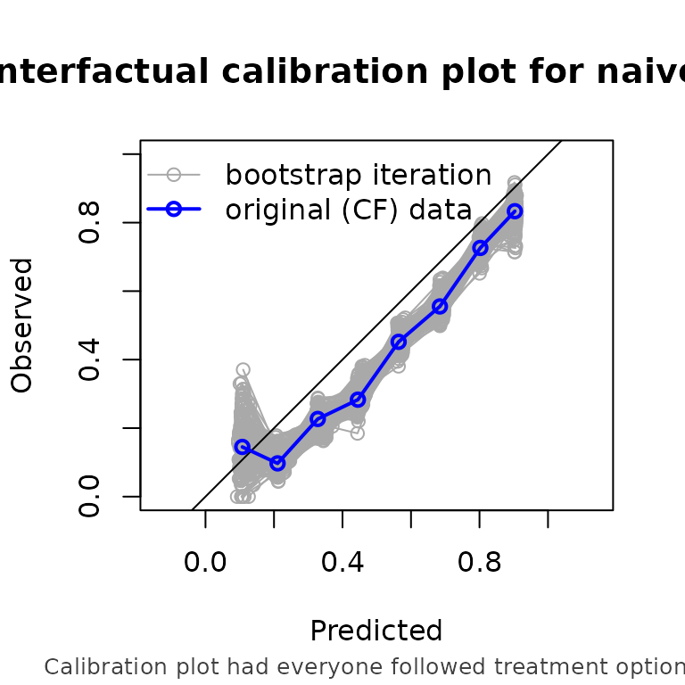

# CFeval

``` r
library(CFeval)
set.seed(1)
```

## Toy example

### Model development

In this toy example, we simulate simulate data for binary outcome Y and
(point) treatment A, with the relation between A and Y confounded by a
variable L. Variable P is a prognostic variable for only the outcome.
The treatment reduces the risk on a bad outcome (Y = 1) in this
simulated example.

``` r
simulate_data <- function(n) {
  data <- data.frame(id = 1:n)
  data$L <- rnorm(n)
  data$A <- rbinom(n, 1, plogis(data$L))
  data$P <- rnorm(n)
  data$Y <- rbinom(n, 1, plogis(0.5 + data$L + 1.25 * data$P - 0.6 * data$A))
  data
}

df_dev <- simulate_data(1000)

head(df_dev)
#>   id          L A          P Y
#> 1  1 -0.6264538 1  0.8500435 1
#> 2  2  0.1836433 0 -0.9253130 0
#> 3  3 -0.8356286 1  0.8935812 1
#> 4  4  1.5952808 1 -0.9410097 0
#> 5  5  0.3295078 1  0.5389521 1
#> 6  6 -0.8204684 0 -0.1819744 0
```

Fitting a (logistic regression) model on this data without accounting
for the confounder L results in a model where treatment apparently
increases the risk on the outcome

``` r
naive_model <- glm(Y ~ P + A, family = "binomial", data = df_dev)
naive_model$coefficients
#>   (Intercept)             P             A 
#> -0.0005233558  0.9986239220  0.4601290887
```

Instead, we could adjust for the confounder L via (for example) inverse
probability of treatment weighting (iptw). \[ref\]

``` r
propensity_model <- glm(A ~ L, family = "binomial", data = df_dev)
propensity_score <- predict(propensity_model, type = "response")
iptw <- 1 / ifelse(df_dev$A == 1, propensity_score, 1 - propensity_score)

causal_model <- glm(Y ~ P + A, family = "binomial", data = df_dev, weights = iptw)
#> Warning in eval(family$initialize): non-integer #successes in a binomial glm!
coefficients(causal_model)
#> (Intercept)           P           A 
#>   0.3100979   0.9750203  -0.2476580
```

From now on we assume some model has been developed (be it a good or a
bad one), and we want to know if it provides accurate estimates of the
counterfactual risk on outcome under both treatment options a = 1 and a
= 0.

### Validation

We assume there is some validation dataset, which are independent from
data used for development of the models. This package aims to help the
user in assessing how well the predictions would match the validation
data if all individuals had followed a certain treatment option of
interest. Note that the causal structure of the validation data set may
be different from the causal structure of the development data set, in
which the model was trained. A model may for example be developed from
RCT data in which treatment was randomly assigned, while we are
validating in an observational cohort in which treatment is confounded
by some variables.

Let’s first simulate some validation data set. In this example, it is
generated using the same mechanism as the development data. It has 5000
rows instead of 1000.

``` r
df_val <- simulate_data(n = 5000)
head(df_val)
#>   id          L A          P Y
#> 1  1  0.7391149 1  0.7051107 1
#> 2  2  0.3866087 0 -0.6268688 1
#> 3  3  1.2963972 1 -0.3230297 0
#> 4  4 -0.8035584 0  0.3596491 0
#> 5  5 -1.6026257 0 -0.9356634 0
#> 6  6  0.9332510 1 -1.0027030 0
```

The main function CFscore() estimates several counterfactual performance
measures in a validation dataset, printing by default the assumptions
required for valid inference. The arguments supplied are the models and
the validation data, a formula for which the left hand side denotes the
outcome variable in the validation data, a treatment formula for which
the left hand side denotes the treatment variable and the right hand
side the confounders required to adjust for said treatment, and the
hypothetical treatment option for which you want to know how well the
model performs if everyone in the population was (counterfactually)
assigned to that treatment.

``` r
cfscore <- CFscore(
  object = list("naive model" = naive_model, "causal model" = causal_model),
  data = df_val,
  outcome_formula = Y ~ 1,
  treatment_formula = A ~ L,
  treatment_of_interest = 1,
  metrics = c("auc", "brier", "oeratio", "calplot")
)

cfscore
#> Estimation of the performance of the prediction model in a
#>  counterfactual (CF) dataset where everyone's treatment A was set to 1.
#> The following assumptions must be satisfied for correct inference:
#> - Conditional exchangeability requires that given IP-weights are
#>  sufficient to adjust for confounding and selection bias between
#>  treatment and outcome.
#> - Positivity (assess $ipt$weights for outliers)
#> - Consistency
#> - No interference
#> - Correctly specified propensity formula. Estimated treatment model is
#>  logit(A) = -0.04 + 1.03*L. See also $ipt$model
#> 
#>         model   auc brier oeratio
#>    null model 0.500 0.249   1.000
#>   naive model 0.748 0.217   0.805
#>  causal model 0.748 0.205   0.934
```

 \* Note that the AUC
of the naive model is equal to the causal model. AUC is driven entirely
by how individuals are ranked, not by the magnitude of the predicted
probabilities. In this simple setting, P is the only variable driving
prognostic differences between individuals in the prediction models.
Even though IPTW changes the estimated coefficients, it does not change
the direction of the association with P. When predicting outcomes under
treatment for everyone, higher values of P still correspond to higher
predicted risk in both models, so individuals are ranked in exactly the
same way. As a result, both models produce identical AUCs.

### Extra options

#### Bootstrap

We can also run a bootstrap to estimate 95% confidence intervals around
the performance metrics.

``` r
CFscore(
  object = list("naive model" = naive_model, "causal model" = causal_model),
  data = df_val,
  outcome_formula = Y ~ 1,
  treatment_formula = A ~ L,
  treatment_of_interest = 1,
  metrics = c("auc", "brier", "oeratio", "calplot"),
  bootstrap = 200,
  bootstrap_progress = FALSE
)
#> Estimation of the performance of the prediction model in a
#>  counterfactual (CF) dataset where everyone's treatment A was set to 1.
#> The following assumptions must be satisfied for correct inference:
#> - Conditional exchangeability requires that given IP-weights are
#>  sufficient to adjust for confounding and selection bias between
#>  treatment and outcome.
#> - Positivity (assess $ipt$weights for outliers)
#> - Consistency
#> - No interference
#> - Correctly specified propensity formula. Estimated treatment model is
#>  logit(A) = -0.04 + 1.03*L. See also $ipt$model
#> 
#> auc
#> 
#>         model   auc lower upper
#>    null model 0.500 0.500 0.500
#>   naive model 0.748 0.723 0.768
#>  causal model 0.748 0.723 0.768
#> 
#> brier
#> 
#>         model brier lower upper
#>    null model 0.249 0.248 0.251
#>   naive model 0.217 0.209 0.227
#>  causal model 0.205 0.198 0.213
#> 
#> oeratio
#> 
#>         model oeratio lower upper
#>    null model   1.000 0.956 1.051
#>   naive model   0.805 0.771 0.846
#>  causal model   0.934 0.895 0.981
```



Further options are to use stabilized iptw, and time to event outcomes.
